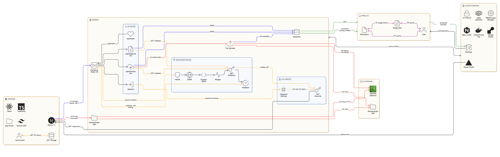

# EduTrack

A minimal full‑stack MVP for tracking student progress with assignments, submissions, and grading.

- Frontend: Next.js + TypeScript + Tailwind CSS
- Backend: Node.js + Express + Sequelize (MySQL)
- Database: MySQL (schema + seed)
- Auth: JWT (roles: teacher, student)

## 📚 Documentation

**📖 [Complete Technical Documentation](./DOCUMENTATION.md)** - Comprehensive guide covering architecture, API, setup, and deployment

**📘 [Documentation Guide](./DOCS-README.md)** - Quick reference for all documentation files

## 🎯 Key Features

- ✅ **Role-Based Authentication** - JWT-based auth with teacher and student roles
- 📝 **Assignment Management** - Teachers create, update, and delete assignments
- 📤 **File Submissions** - Students submit assignments with file uploads
- 🎓 **Grading System** - Teachers grade and provide feedback
- 📊 **Progress Tracking** - Real-time dashboards for both roles
- 🔒 **Secure** - Bcrypt password hashing, JWT tokens, input validation

## 🏗️ Architecture Overview

```
Frontend (Next.js) → API (Express.js) → Database (MySQL)
                  ↓
            File Storage (Local)
```

### System Architecture Diagram




## Folders

- `frontend/` – Next.js app (app router) with AuthContext, pages, and components
- `backend/` – Express API with Sequelize models, JWT auth, file uploads
- `database/` – SQL schema, seed, and connection test

## Quick start (Windows PowerShell)

1. Create .env files using the provided examples in `backend/.env.example` and `frontend/.env.local.example`.
2. Install backend dependencies and start server:
   - See `backend/README.md` for exact steps.
3. Install frontend dependencies and start dev server:
   - See `frontend/README.md` for exact steps.

See each folder README for detailed instructions and API/page documentation.

## 📖 Full Documentation

For complete technical documentation including:
- Detailed architecture and data flow
- Complete API reference
- Database schema and relationships
- Security implementation details
- Setup and deployment guides
- Troubleshooting and best practices

**👉 Read [DOCUMENTATION.md](./DOCUMENTATION.md)**
